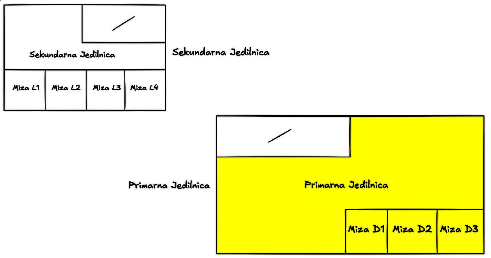
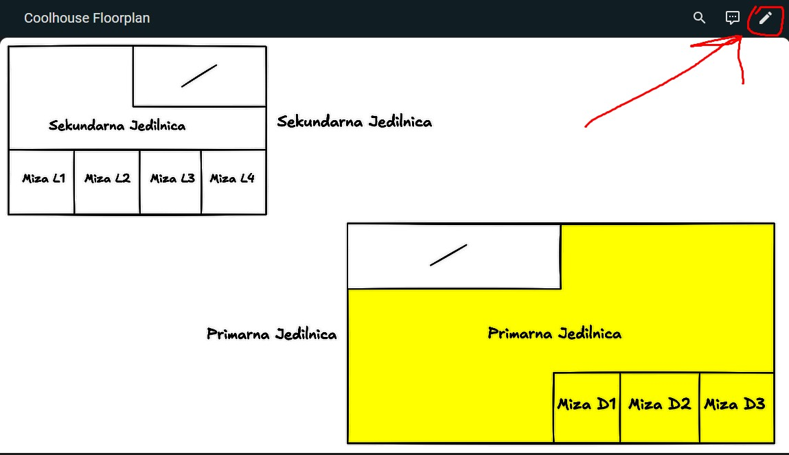
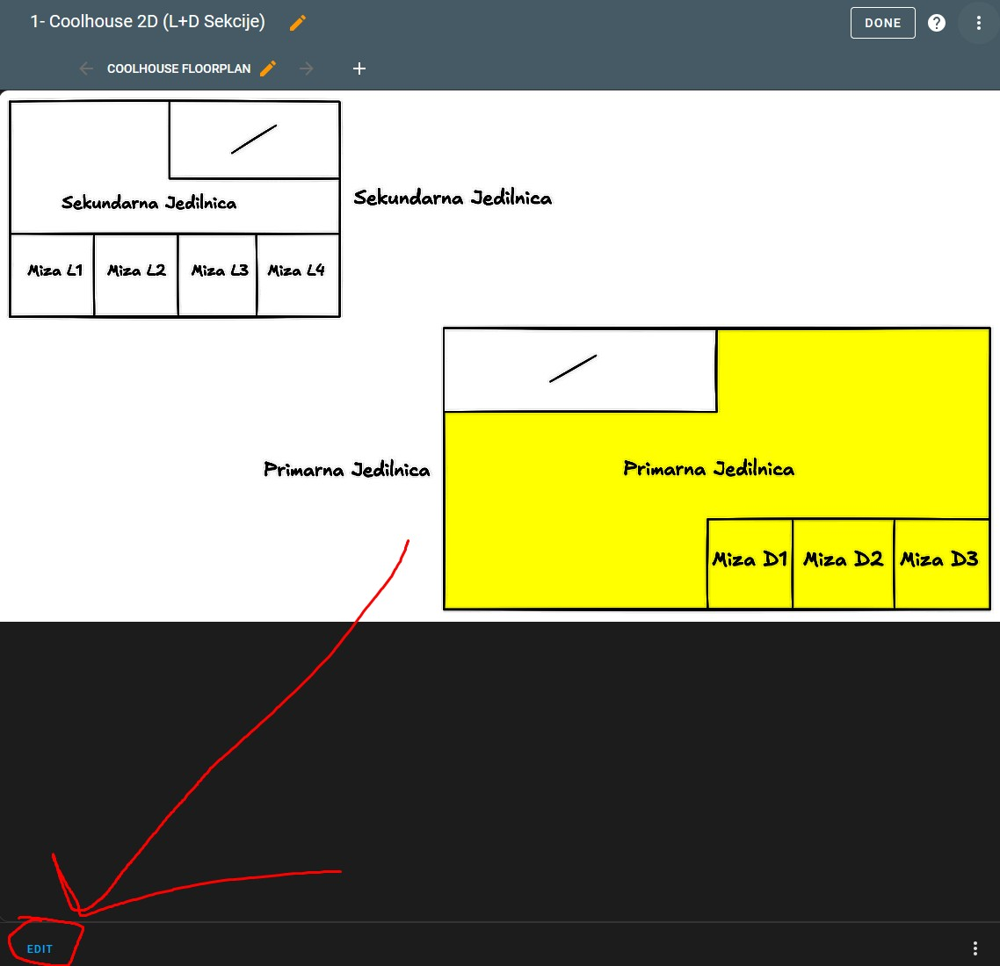
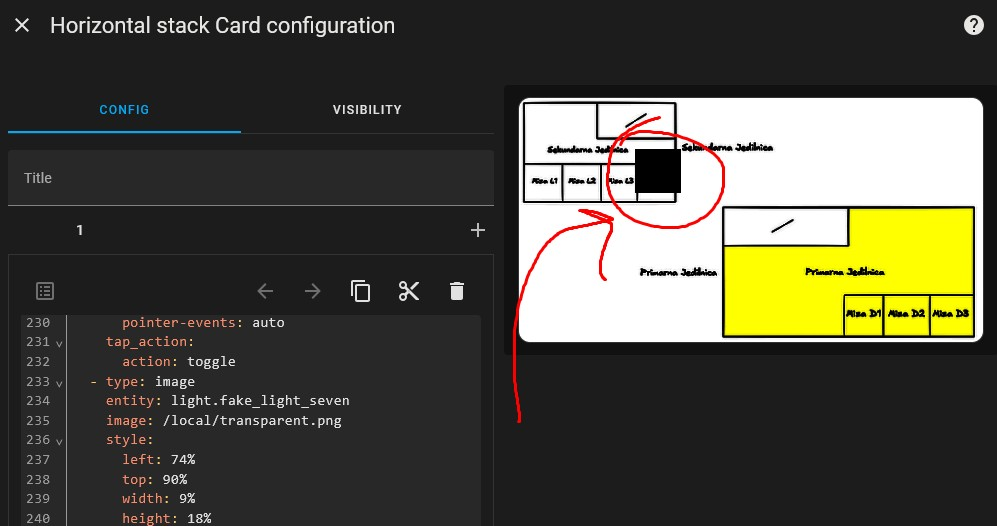
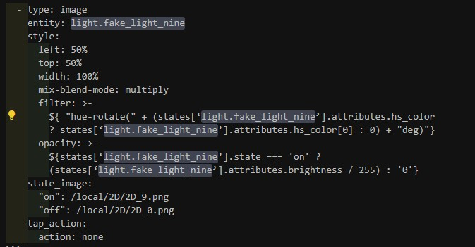
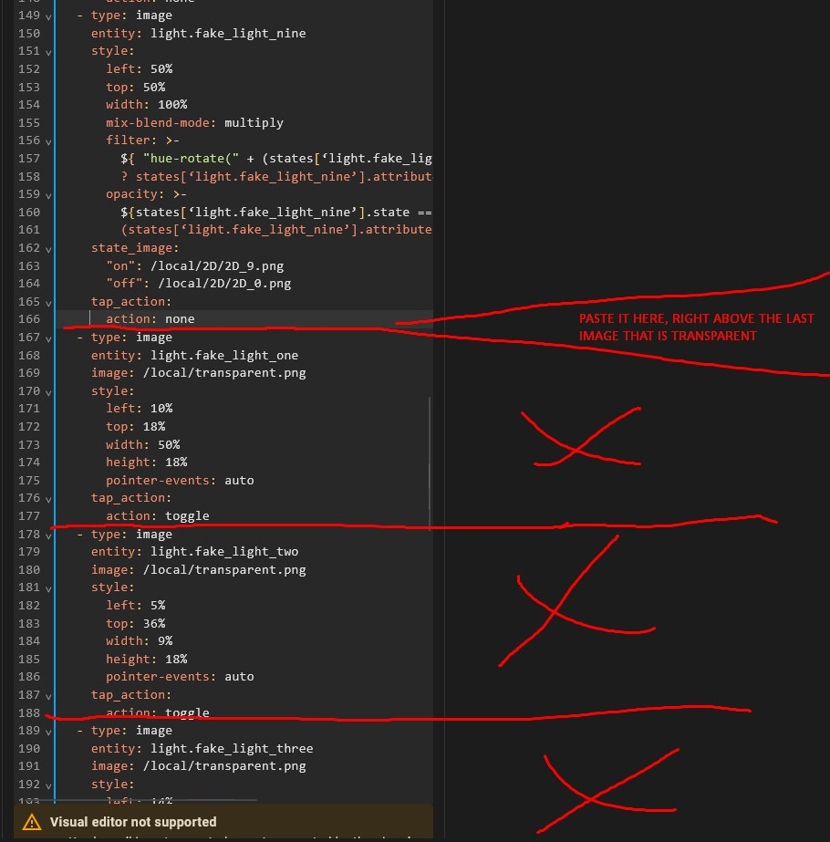
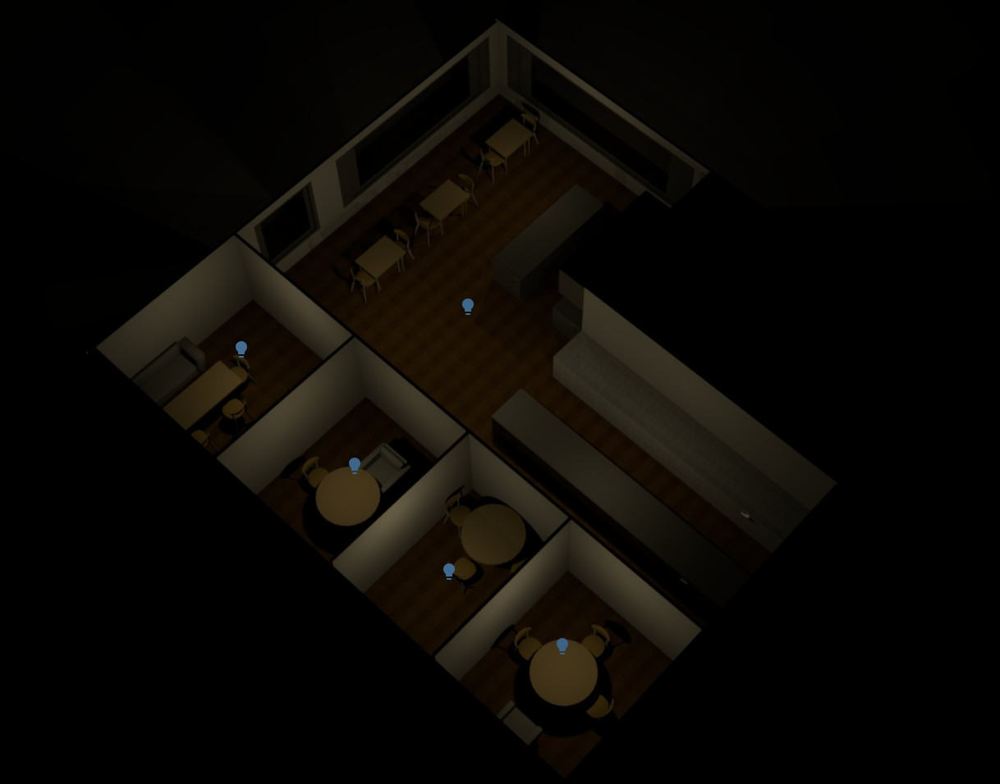
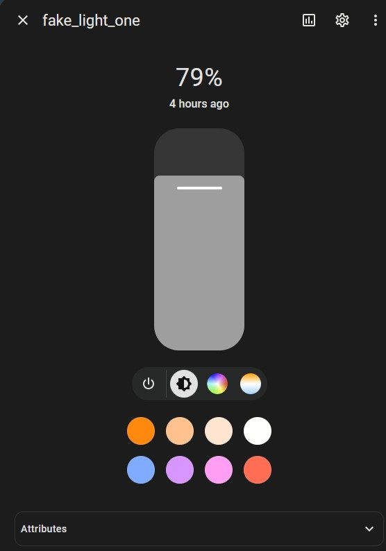
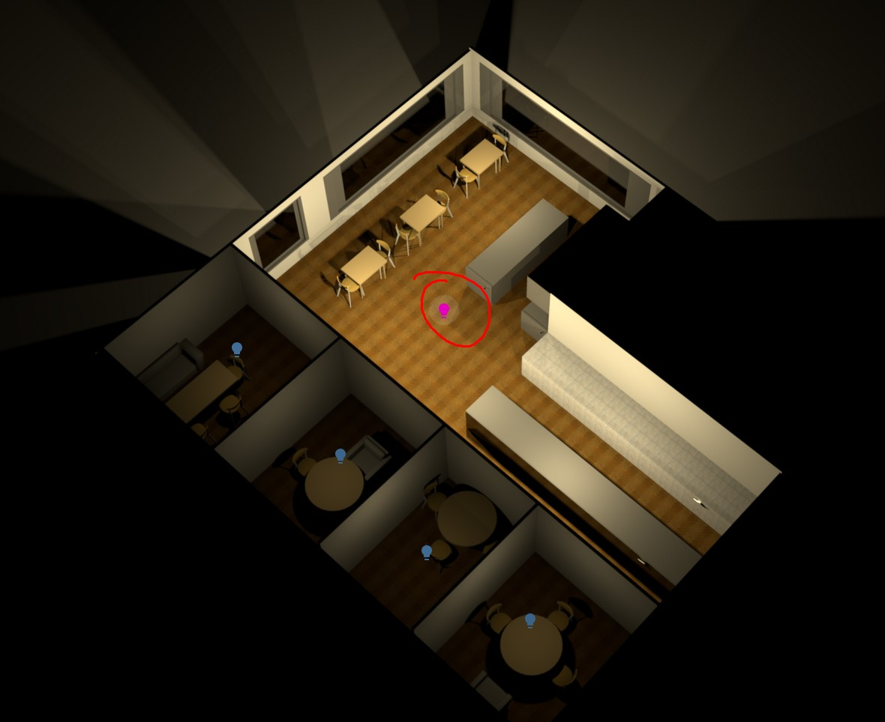

# Smart Restaurant Lighting System Prototype – Customization Guide to tailor it to your own restaurant using Home Assistant (H.A.)

This document provides comprehensive setup instructions for deploying an intelligent lighting system tailored for a restaurant environment, built on top of H.A. The system supports presence detection, air quality-based alerts, event-triggered ambient lighting, and visual 2D/3D dashboards for real-time light management with visual responsiveness.

## 1. Prerequisites

To deploy this system, please ensure that your restaurant meets the following prerequisites:

- Stable LAN/internet access.
- H.A. Container instance running anywhere (Docker, locally hosted, hosted on a cloud, etc.).
- Please make sure that you are specifically running a H.A. Container, not H.A. OS or other ways to run H.A. - it might work there as well, but no testing has been done for it.
  
## (Optional) One of the above-mentioned options: Install Home Assistant via Docker

Please watch the following video for help. 

Should you run into any issues, do not hesitate to ask for help on the H.A. community forum: https://community.home-assistant.io/.

[](https://www.youtube.com/watch?v=9Odsu3G3n_o)

## 2. Features

Now we will get started with the features that you can achieve using our pre-made instance of Smart Lighting for a Restaurant, which was made for a Slovenian restaurant. Pre-made instructions will be marked with a sub-numbering of 2.x.2. If you wish to start from a fresh installation, instructions for you will be marked with numbering 2.x.3.

## 2.1 2D Interactive light dashboard

For this dashboard we will be utilizing the power of the `lighten` blend mode.

In this restaurant floorplan, each dining section or table area is represented as a **clickable square**. These squares are integrated with Home Assistant (HA) to allow easy lighting control directly from the dashboard.

### How It Works:



- **Interactive Lighting**:  
  When you click on a section (e.g. *Primarna Jedilnica*, *Miza D1*, *Miza L2*), the system **toggles** the state of the corresponding light:
  - If the light is **off**, it turns **on**.
  - If the light is **on**, it turns **off**.
  
- **Visual Feedback**:
  - 🟡 **Yellow**: The light for that section is **on**.
  - ⚪ **White**: The light for that section is **off**.

- **Non-Controllable Areas**:  
  Sections that have a **diagonal slash ( / )** in them do **not have Home Assistant-controlled lighting** and are not interactive.

---

This intuitive interface makes it easy for staff to manage ambient lighting in real time, just by tapping the visual map, without needing to navigate menus or find specific light names.


## 2.1.1 Prerequisites

- You must have at least one light entity registered within H.A., if you do not have any physical lights connected then you can utilize the [Hass Virtual add-on](https://github.com/twrecked/hass-virtual) ([installed with HACS community store](https://www.hacs.xyz/)) to create virtual lights. 

Is this included in the pre-made template? ✅ In the pre-made template you have 9 included virtual light entities, all named starting from `fake_light_one` all the way up to `fake_light_nine`. If you wish to add more lights, just add the following code block at the end of the `virtual.yaml` file within your H.A. config folder, all you have to do is change the `name:` line so that it doesn't match any previous light entity names:

```
    - name: fake_light_ten
      platform: light
      initial_value: 'on'
      support_brightness: true
      initial_brightness: 100
      support_color: true
      initial_color: [0, 255]
      support_color_temp: true
      initial_color_temp: 255
      support_white_value: true
      initial_white_value: 240
```

- File System Access - make sure H.A. has a `www/` folder within the config directory - this is where all your images will be placed. 

Is this included in the pre-made template? ✅ Yes, in the pre-made template a `www/` folder is included, as well as images for a 2-floor or 2-section restaurant system composed of 5+4 lights for each section.

## 2.1.2 Modifying the pre-made template

This guide explains how to update the existing `picture-elements` card used for interactive lighting in your restaurant dashboard.

### Step 1: Prepare Your Floorplan Images

Make sure you have the following assets placed inside the `www/2D/` directory (accessible via `/local/2D/`):

- `2D_0.png` — base image (all lights off)
- `2D_1.png` to `2D_9.png` — images showing individual lights on (one light on per picture!)

Make sure the following two are within `www/`:
- `transparent.png` — clickable overlay image (fully transparent)
- `black.png` — clickable overlay image (fully black, only used for setup purposes)

If you want to see physical examples of how the pictures should look like, open the `template` folder within this repository and check the `/src/env/config/www/2D` folder and take a look for yourself.

> 💡 You can generate or edit these images to reflect new tables, rooms, or layout changes.

---

### Step 2: Add or Update Light Entities

Ensure that each light (e.g. `light.fake_light_one`) exists in Home Assistant. 

Update your `configuration.yaml` accordingly, if needed - depending on which lights you are using (physical, virtual, etc.).

---

### Step 3: Update the YAML View

Open `2d-dash-v2.yaml` within `.storage` folder (or edit through the GUI in **Raw Configuration Editor**) and locate the `picture-elements` section.

### (Optional) Step 4: Add a New Light:

Run your HA instance via docker and access the following link: `http://localhost:8123/2d-dash-v2/first`, if you are running the instance on a Cloud or different environment, then adjust the link accordingly, replacing `localhost` with your hosted domain name or IP.

At the very top right of your screen there will be a pen, click this pen. 



After clicking the pen, scroll all the way down to the bottom of the page and find the `EDIT` button located right beneath the image within the dashboard.



Now paste the following code at the end of the file within the visual editor that just opened:

```
  - type: image
    entity: light.fake_light_one
    image: /local/black.png
    style:
      left: 30%
      top: 30%
      width: 10%
      height: 18%
      pointer-events: auto
    tap_action:
      action: toggle
```

Now you should see a black square over the dashboard on the image preview:



Adjust the `left` and `top` measurements until you have the rectangle exactly over the section you wish to have clickable for light toggling purposes, after that you can increase or lower its size with the `width` and `height` properties. 

If you wish to use different shapes to adjust to your preferred 2D design and interface you have to make two copies of  the same shape, one fully black and one fully transparent and then add those images to the `www/` folder within the HA config. Then proceed as written prior, just replace the line  `image: /local/black.png` with proper file routing, if one of your new files is named `black_circle.png` then you must name the line `image: /local/black_circle.png`.

After you are satisfied with your location, size and shape of your black object then you simply have to change the pathing from `image: /local/black.png` to `image: /local/transparent.png`. The black object must disappear from the image preview. This means we have successfully added a clickable invisible shape. 

Now let's connect it to an action, adjust the following code's entity to the light you wish to adjust:

```
  - type: image
    entity: light.fake_light_nine
    style:
      left: 50%
      top: 50%
      width: 100%
      mix-blend-mode: multiply
      filter: >-
        ${ "hue-rotate(" + (states[‘light.fake_light_nine’].attributes.hs_color
        ? states[‘light.fake_light_nine’].attributes.hs_color[0] : 0) + "deg)"}
      opacity: >-
        ${states[‘light.fake_light_nine’].state === 'on' ?
        (states[‘light.fake_light_nine’].attributes.brightness / 255) : '0'}
    state_image:
      "on": /local/2D/2D_9.png
      "off": /local/2D/2D_0.png
    tap_action:
      action: none
```

If you are using Visual Studio Code you can press `CTRL+SHIFT+L` to select all instances of that light to change them all at once, as shown below:



Rename them to your desired entity, for example `light.cool_light`.

Now change the following lines to your correct pathing:
- `"on": /local/2D/2D_9.png` Insert pathing to the image where exclusively only this light is on.
- `"off": /local/2D/2D_0.png` Insert pathing to the image where all lights are off.

After you are done editing that codeblock, paste it at the end of the last image instance that is not a transparent image, as visualized below:




Your new added light should now be working.

---

### Step 4: Mark Non-Controlled Areas

For sections **not controlled by Home Assistant**, you should do the following:

- Do **not** add any clickable/toggle overlays.
- Optionally, draw a diagonal slash `/` (or other marking) in your base image to indicate "no control".

---

### Additional debugging tips

If you are not using a white background for your light being off and your base image (where all the lights are off) then you may not need the `multiply` blend mode. If you are having issues try switching to the `lighten` blend mode, which we will be using below for the 3D dashboard.


[Read more about blending modes here if you want to dive into detail on this topic, or if you want heavy customization.](%5Bhttps://helpx.adobe.com/photoshop/using/blending-modes.html%5D%28Read%20more%20about%20blending%20modes%20here%29).


### Summary of customizing the 2D dashboard template

- 🖼️ Background (base) image = `/local/2D/2D_0.png`
- 🟡 Yellow section =  light is on (`2D_1.png`, `2D_2.png`, etc.)
- ⚪ White section = light off (base image, `2D_0.png`)
- 🖱️ Transparent overlay toggles lights

---

### 2.1.3 Fresh start

If you'd like to start fresh then you must first refer to the `(Optional) Step 4: Add a New Light:` in section 2.1.2.
Instead of `2d-dash-v2` as show in 2.1.2, put in the name of your dashboard `yaml` file instead.

Start your dashboard file with the following code:
```
type: picture-elements
image: /local/all_lights_off_pathing_here.jpg
panel: true
elements:
  - type: image
    entity: light.fake_light_one
    style:
      left: 50%
      top: 50%
      width: 100%
      mix-blend-mode: lighten
      filter: >-
        ${ "hue-rotate(" + (states[‘light.fake_light_one’].attributes.hs_color ?
        states[‘light.fake_light_one’].attributes.hs_color[0] : 0) + "deg)"}
      opacity: >-
        ${states[‘light.fake_light_one’].state === 'on' ?
        (states[‘light.fake_light_one’].attributes.brightness / 255) : '0'}
    state_image:
      "on": /local/this_light_on_pathing.jpg
      "off": /local/all_lights_off_pathing_here.jpg
    tap_action:
      action: none
```

Replace all `/local/all_lights_off_pathing_here.jpg` instances with pathing to the file where all your lights are off. Replace the `/local/this_light_on_pathing.jpg` instance with pathing to the file where the light you wish to control is on. Now you should be able to continue all the steps in 2.1.2.

## 2.2 3D Interactive light dashboard

For this dashboard we will be utilizing the power of the `multiply` blend mode.

We initially tried this without researching blend modes, therefore the complexity was initially `n^2` number of images and loading time, as we would have needed all the possible combinations of the lights on and off. After utilizing this powerful blend mode it lowers our complexity to `n` number of images and loading time, only needing a base image and one additional image for each light - exact same as the 2D dashboard.

In this restaurant floorplan, each dining section or table area is represented as a **clickable icon**. These icons are integrated with Home Assistant (HA) to allow easy lighting control directly from the dashboard. Upon a short click these icons provide a simple boolean toggle, upon holding them they provide advanced customization such as color.

### How It Works:



- **Interactive Lighting**:  
  When you click on a light bulb icon, the system **toggles** the state of the corresponding light:
  - If the light is **off**, it turns **on**.
  - If the light is **on**, it turns **off**.
  - If you hold for a long time instead of issuing a short click, the following interface will appear for further light state customization (such as color and precise brightness):

  
- **Visual Feedback**:
  - 🌈 **Colored light (Lightbulb appears in the color of the current state of the light)**: The light for that section is **on**. For example, when the light is in purple state and is on:
  
  - 🔵 **Dark blue light icon**: The light for that section is **off**.

- **Non-Controllable Areas**:  
  Sections that have a **diagonal slash ( / )** in them or are **blacked out** do **not have Home Assistant-controlled lighting** and are not interactive.

---

This intuitive interface makes it easy for staff to manage ambient lighting in real time, just by tapping the visual map, without needing to to navigate menus or find specific light names.


## 2.2.1 Prerequisites

- You must have at least one light entity registered within H.A., if you do not have any physical lights connected then you can utilize the [Hass Virtual add-on](https://github.com/twrecked/hass-virtual) ([installed with HACS community store](https://www.hacs.xyz/)) to create virtual lights. 

Is this included in the pre-made template? ✅ In the pre-made template you have 9 included virtual light entities, all named starting from `fake_light_one` all the way up to `fake_light_nine`. If you wish to add more lights, just add the following code block at the end of the `virtual.yaml` file within your H.A. config folder, all you have to do is change the `name:` line so that it doesn't match any previous light entity names:

```
    - name: fake_light_ten
      platform: light
      initial_value: 'on'
      support_brightness: true
      initial_brightness: 100
      support_color: true
      initial_color: [0, 255]
      support_color_temp: true
      initial_color_temp: 255
      support_white_value: true
      initial_white_value: 240
```

- File System Access - make sure H.A. has a `www/` folder within the config directory - this is where all your images will be placed. 

Is this included in the pre-made template? ✅ Yes, in the pre-made template a `www/` folder is included, as well as images for a 1-floor 3D design of a restaurant with 5 lights.

## 2.2.2 Modifying the pre-made template

This guide explains how to update the existing `picture-elements` card used for interactive lighting in your restaurant dashboard.

### Step 1: Prepare Your Floorplan Images

Make sure you have the following assets placed inside the `www/3DL/` directory (accessible via `/local/3DL/`):

- `3DL_0.png` — base image (all lights off)
- `3DL_1.png` to `3DL_9.png` — images showing individual lights on (one light on per picture!)

Make sure the following two are within `www/`:
- `transparent.png` — clickable overlay image (fully transparent)
- `black.png` — clickable overlay image (fully black, only used for setup purposes)

If you want to see physical examples of how the pictures should look like, open the `template` folder within this repository and check the `/src/env/config/www/3DL` folder and take a look for yourself.

> You can generate or edit these images to reflect new tables, rooms, or layout changes.

---

### Rest of the customization process

The rest of the customization process is nearly identical to the 2D dashboard process, refer to that. Keep in mind two crucial differences, though:

### Difference #1
We used **clickable lightbulb icons** for the 3D dashboard instead of using transparent **clickable shapes** as in the 2D dashboard. But you can use whichever, just a heads up. The code for customizing the light bulb icons instead of transparent shapes is as follows, you can customize it with the instructions from sections 2.1:

```
  - type: state-icon
    entity: light.fake_light_one
    style:
      left: 47%
      top: 43%
      opacity: 100%
    tap_action:
      action: toggle
```

### Difference #2

You must use `multiply` blend mode for 3D images instead of `lighten`. Code is identical to that of the 2D dashboard from before, with this slight change. Once again, refer to sections 2.1 for instructions on how to customize this code for a different light:

```
  - type: image
    entity: light.fake_light_two
    style:
      left: 50%
      top: 50%
      width: 100%
      mix-blend-mode: lighten
      filter: >-
        ${ "hue-rotate(" + (states[‘light.fake_light_two’].attributes.hs_color ?
        states[‘light.fake_light_two’].attributes.hs_color[0] : 0) + "deg)"}
      opacity: >-
        ${states[‘light.fake_light_two’].state === 'on' ?
        (states[‘light.fake_light_two’].attributes.brightness / 255) : '0'}
    state_image:
      "on": /local/3DL/3DL_2.png
      "off": /local/3DL/3DL_0.png
    tap_action:
      action: none
```

---

# New section


